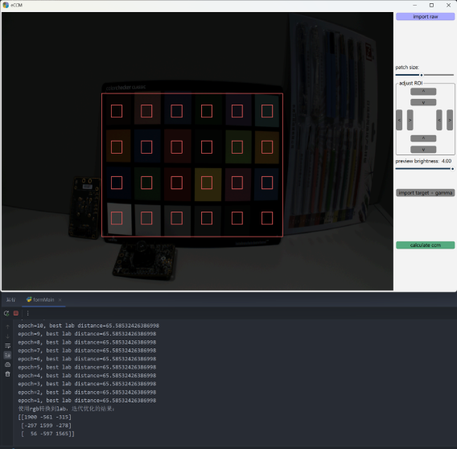

# CCM 优化工具

运行测试结果：



## 安装依赖

```bash
# 使用 uv (推荐)
uv add pyside6 numpy setuptools
uv add torch==2.4.1+cpu --index https://download.pytorch.org/whl/cpu
```
## 编译 C 扩展

项目包含一个最小化的 C 扩展 `demosaic` 用于 Bayer 去马赛克：

```bash
# 编译 demosaic C 扩展
uv run python setup.py build_ext --inplace
```

编译后的 `.pyd` 文件将放置在 `src/` 目录中。

## 使用说明

1. 首先点击`import raw`按钮，子目录`raw_img`内附带了一张16bit hdr raw， blc=168, bayer=GRBG, 1920*1080，供测试使用。
2. 点击`import target + gamma`，导入`target.json`当中的设置。
3. 拖动preivew brightness滑块，调整预览亮度。
4. 用鼠标在色卡上，从左上到右下角拉出一个矩形，拖动patch size滑块调整色块的roi大小。
5. 用`adjust ROI`里面的按钮微调边界。
6. 点击`calucate ccm`，观察结果，可以多试几次找到最优解。

## 运行应用

```bash
python ccm_optimizer.py
```

或使用 uv:
```bash
uv run python ccm_optimizer.py
```

## nuitka打包

```bash
uv add nuitka

python -m nuitka ./ccm_optimizer.py --msvc=latest --enable-plugin=pyside6 --include-qt-plugins=sensible,styles --nofollow-imports --follow-import-to=src --mode=standalone --windows-console-mode=force --include-windows-runtime-dlls=no
```
windows平台上打包后103MB，使用7z压缩之后25MB。

## 技术细节

### Bayer 去马赛克 C 扩展
- 文件: `demosaic.c` + `setup.py`
- 算法: 双线性插值
- 支持的 Bayer 模式: RGGB, GRBG, GBRG, BGGR
- Python API: `demosaic.bayer2bgr(bayer_array, pattern)`

## 算法
```text
1. rgb --> ccm + clip --> rgb          ◀--------------
2. rgb --> OKLAB --> lab                             ▕
3. lab --> gamut mapping + y blending --> lab        ▕
4. lab --> inv OKLAB --> rgb                         ▕
5. rgb --> inv gamma(optional) --> rgb               ▕
6. rgb --> lab                                       ▕
7. lab <=> target lab --> delta C                    ▕
|                                                    ▕
▼                                                    ▕
loop iter ---------------------------------------------
```
